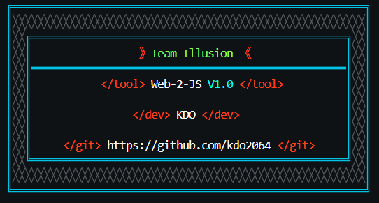

# Web-2-Js: Convert HTML to JS in seconds!

**Web-2-Js** is a powerful tool created by **Team Illusion** member **KDO** that allows you to convert **HTML** code to **JavaScript** in a matter of seconds. This tool is compatible with Windows, Linux, and Termux operating systems.

## Installation

### Prerequisites

- **Operating System**: Windows,Linux or Termux
- **Python**: Version 3.8 or higher

### Steps

1. Clone the repository: `git clone https://github.com/kdo2064/Web-2-JS`
2. Navigate to the project directory: `cd Web-2-JS`
3. Run the tool using the following command:
	* On Windows: `python main.py`
	* On Linux and Termux: `python3 main.py`

## Usage

1. Run the `main.py` file using the command above.
2. Enter the name of your HTML file with its full extension (e.g. `example.html`).
3. The tool will process the file and generate a new file named `Deface.html` in the same directory.

**Note**

* Make sure the HTML file is in the same directory as the `main.py` file.
* The output file will be named `Deface.html` and will be generated in the same directory.

## Important Notes

- **Legal Disclaimer**: This tool is intended for educational purposes only. Unauthorized use of this tool against any website without explicit permission is illegal and unethical. The developers of Web-2-Js and Team Illusion are not responsible for any misuse or damages caused by this tool.

## Visiter

